# UP RERA Property Scraper

A web scraper that collects real estate project data from the Uttar Pradesh Real Estate Regulatory Authority (UP RERA) website and stores it in AWS S3.

## What it does

* Scrapes property listings from [up-rera.in](https://www.up-rera.in)
* Extracts project details: name, RERA number, promoter, location, dates, etc.
* Saves data as JSON files to AWS S3 (partitioned by date)
* Runs as a web service (accessible via HTTP API)
* Uses AI agent to coordinate scraping tasks
* Handles pagination and retries automatically

---

## Scraper Architecture

```mermaid
flowchart LR
    User([👤 User/Client])
    
    subgraph AWS["☁️ AWS Cloud Infrastructure"]
        direction TB
        
        subgraph AppRunner["🚀 AWS App Runner"]
            direction LR
            API["🌐 FastAPI<br/>Port 8080"]
            Agent["🤖 AI Agent<br/>Scraper"]
            MCP["⚙️ MCP Server<br/>Scraping Logic"]
            Browser["🌍 Playwright<br/>Headless Browser"]
        end
        
        subgraph Storage["💾 Storage Layer - ECR & S3"]
            direction TB
            ECR[("🐳 AWS ECR<br/>Docker Images")]
            S3[("📦 AWS S3<br/>Scraped Data<br/><i>year/month/day</i>")]
        end
        
        subgraph AI["🧠 AI Services - Bedrock & OpenAI"]
            direction TB
            Bedrock["☁️ AWS Bedrock<br/>Claude Haiku"]
            OpenAI["📊 OpenAI Platform<br/><i>Traces Only - $0</i>"]
        end
    end
    
    External["🏢 UP RERA Website<br/>up-rera.in"]
    
    User ==>|"1️⃣ HTTP GET<br/>/agents?max_projects=N"| API
    API ==>|"2️⃣ Coordinate"| Agent
    Agent ==>|"3️⃣ Call MCP Tool"| MCP
    MCP ==>|"4️⃣ Launch"| Browser
    Browser ==>|"5️⃣ Scrape HTML"| External
    External ==>|"6️⃣ Return Data"| Browser
    Browser ==>|"7️⃣ Parse JSON"| MCP
    MCP ==>|"8️⃣ Return Results"| Agent
    Agent ==>|"9️⃣ Upload NDJSON using Agent Tool"| S3
    Agent -.->|"🔍 Query LLM"| Bedrock
    Agent -.->|"📈 Send Traces"| OpenAI
    API ==>|"🔟 JSON Response"| User
    
    ECR -.->|"Pull Image"| AppRunner
    
    classDef userStyle fill:#4A90E2,stroke:#2E5C8A,stroke-width:3px,color:#fff
    classDef apiStyle fill:#FF6B6B,stroke:#C92A2A,stroke-width:3px,color:#fff
    classDef agentStyle fill:#A855F7,stroke:#7C3AED,stroke-width:3px,color:#fff
    classDef mcpStyle fill:#10B981,stroke:#059669,stroke-width:3px,color:#fff
    classDef browserStyle fill:#F59E0B,stroke:#D97706,stroke-width:3px,color:#fff
    classDef storageStyle fill:#3B82F6,stroke:#1E40AF,stroke-width:3px,color:#fff
    classDef aiStyle fill:#8B5CF6,stroke:#6D28D9,stroke-width:3px,color:#fff
    classDef externalStyle fill:#14B8A6,stroke:#0F766E,stroke-width:3px,color:#fff
    classDef awsStyle fill:#FFF9E6,stroke:#FF9900,stroke-width:3px,color:#232F3E
    classDef appRunnerStyle fill:#232F3E,stroke:#FF9900,stroke-width:3px,color:#FF9900
    classDef storageGroupStyle fill:#E6F7FF,stroke:#1890FF,stroke-width:3px,color:#003A70
    classDef aiGroupStyle fill:#F0E6FF,stroke:#9254DE,stroke-width:3px,color:#531DAB
    
    class User userStyle
    class API apiStyle
    class Agent agentStyle
    class MCP mcpStyle
    class Browser browserStyle
    class ECR,S3 storageStyle
    class Bedrock,OpenAI aiStyle
    class External externalStyle
    class AWS awsStyle
    class AppRunner appRunnerStyle
    class Storage storageGroupStyle
    class AI aiGroupStyle
```



**Key Components:**
- **FastAPI Service**: HTTP API endpoint for scraping requests
- **AI Agent**: Orchestrates the workflow using AWS Bedrock (Claude)
- **MCP Server**: Model Context Protocol server handling scraping logic
- **Playwright Browser**: Headless browser for web scraping
- **AWS ECR**: Stores Docker container images
- **AWS S3**: Stores scraped data with date partitioning
- **OpenAI Platform**: Tracing/observability only (no cost)

---

## Data Format

Each project record includes:
- Project name and RERA registration number
- Promoter/developer name
- Project type (Residential/Commercial)
- District/location
- Start date, end date, registration date
- Link to detailed project page
- Raw text field (for vector search)

---

## Prerequisites

You'll need:
- **Docker Desktop** - For containerized development
- **Tilt** - For local Kubernetes development and hot-reloading
- **kubectl** - Kubernetes command-line tool
- **Python 3.12+** and **uv** - (optional, for non-Docker development)
- **AWS CLI** - For deployment to AWS App Runner
- **Terraform** - For infrastructure as code

---

## Quick Start (Local Development with Tilt)

### Setup

1. **Navigate to project directory:**
   ```sh
   cd real-estate-scrapers/scrapers/up-rera-scraper-app-runner
   ```

2. **Set up environment variables:**
   ```sh
   cp .env.tmpl .env
   # Edit .env and add your credentials:
   # - OPENAI_API_KEY
   # - AWS_ACCESS_KEY_ID
   # - AWS_SECRET_ACCESS_KEY
   ```

3. **Start with Tilt:**
   ```sh
   tilt up
   ```

   Tilt will automatically:
   - Build the Docker image
   - Deploy to local Kubernetes
   - Set up hot-reloading for code changes
   - Open Tilt dashboard in browser (http://localhost:10350)

4. **Access the application:**
   - API: Check Tilt UI for service URL (usually `http://localhost:8080`)
   - Tilt Dashboard: `http://localhost:10350`
   - API Docs: `http://localhost:8080/docs`

5. **Stop when done:**
   ```sh
   tilt down
   ```

### Test the Scraper

Scrape 20 projects:
```sh
curl -X 'GET' \
  'http://localhost:8080/agent/?max_projects=20' \
  -H 'accept: application/json'
```

Scrape 50 projects:
```sh
curl -X 'GET' \
  'http://localhost:8080/agent/?max_projects=50' \
  -H 'accept: application/json'
```

## Environment Variables

Create a `.env` file from the template:

```sh
cp .env.tmpl .env
```

Required variables:

```bash
# OpenAI API Key (for AI agent tracing only - no cost incurred)
OPENAI_API_KEY=sk-your-openai-key

# AWS Configuration (for local development only)
AWS_ACCESS_KEY_ID=your_access_key
AWS_SECRET_ACCESS_KEY=your_secret_key
AWS_REGION=us-east-1

# S3 Storage
S3_BUCKET=your-bucket-name
S3_PREFIX=scrapers/up-rera-scraper-app-runner
```

**Important Notes:**
- Never commit the `.env` file with real credentials to version control!
- **OPENAI_API_KEY usage**: This key is used **only for tracing/observability** purposes. No API calls are made to OpenAI models, so **$0 will be charged**. The key enables you to view execution traces in the [OpenAI Platform](https://platform.openai.com/traces) for debugging and monitoring agent workflows.

---

## Development Workflow with Tilt

### What is Tilt?

Tilt automates local development by building Docker images, deploying to Kubernetes, and live-reloading on code changes. All logs and status are shown in a unified dashboard.

### Common Commands

```sh
# Start development environment
tilt up

# Stop and clean up
tilt down
```

### Hot Reloading

When you edit Python files, Tilt automatically:
1. Detects the change
2. Rebuilds the Docker image
3. Redeploys the container
4. Shows updated logs in the dashboard
5. No manual restarts needed!

---

## Deployment to AWS App Runner


### Initial Infra Setup

```sh
cd terraform

./tf-infra-wrapper.sh dev init
./tf-infra-wrapper.sh dev plan
./tf-infra-wrapper.sh dev apply
```

Get the service URL:
```sh
./tf-infra-wrapper.sh dev output -raw app_runner_service_url
```


### Deployment of Docker Image

```sh
uv run deploy.py
```

This script will:
1. Build Docker image for `linux/amd64`
2. Push to AWS ECR
3. Deploy to AWS App Runner
4. Output the service URL

---

## Infrastructure Resources Created

The Terraform configuration creates the following AWS resources:

### Container & Compute
- **AWS ECR Repository** - Container registry for Docker images
  - Name: `{scraper_name}-scraper`
  - Image tag mutability: Mutable
  - Scan on push: Disabled

- **AWS App Runner Service** - Serverless container service
  - Service name: Auto-generated with 40-char limit
  - Instance config: 1 vCPU, 2 GB memory
  - Port: 8080
  - Auto-deployment: Disabled (manual deployment)

### IAM Roles & Policies
- **App Runner Service Role** - For ECR access and task execution
  - Trusted entities: `build.apprunner.amazonaws.com`, `tasks.apprunner.amazonaws.com`
  - Attached policy: `AWSAppRunnerServicePolicyForECRAccess`

- **App Runner Instance Role** - Runtime permissions for the container
  - Trusted entity: `tasks.apprunner.amazonaws.com`
  - Custom policies:
    - **Bedrock Access**: `InvokeModel`, `InvokeModelWithResponseStream`, `ListFoundationModels`
    - **S3 Access**: `PutObject`, `GetObject`, `ListBucket` on configured bucket/prefix

### Environment Variables Configured
- `OPENAI_API_KEY` - OpenAI API access
- `LLM_MODEL` - Bedrock model identifier
- `AWS_REGION_NAME` - AWS region
- `S3_BUCKET` - Target S3 bucket for scraped data
- `S3_PREFIX` - S3 prefix/path for organizing data

### Cost Considerations
- **ECR**: Storage costs for Docker images (~$0.10/GB/month)
- **App Runner**: 
  - Compute: ~$0.064/vCPU-hour + ~$0.007/GB-hour when active
  - Requests: $0.20/million requests (after free tier)
  - Free tier: 40 vCPU-hours, 80 GB-hours, 2M requests/month

---

## Project Structure

```text
up-rera-scraper-app-runner/
├── Tiltfile                     # Tilt configuration
├── Dockerfile                   # Multi-stage Docker build
├── pyproject.toml              # Python dependencies
├── .env.tmpl                   # Environment template
├── deploy.py                   # Deployment script
├── src/
│   └── server/
│       ├── main.py             # FastAPI entry point
│       └── agent/
│           ├── agent.py        # AI agent orchestration
│           ├── routes.py       # HTTP API endpoints
│           ├── mcp_servers.py  # Scraping logic
│           ├── tools.py        # Helper tools (S3 upload)
│           └── context.py      # Query builder
└── terraform/                  # Infrastructure as code
    └── tf-modules/
        └── app-runner/         # App Runner config
```

---

## API Reference

### GET /

Scrape UP RERA projects and save to S3

**Query Parameters:**
- `max_projects` (optional, default: 20) - Number of projects to scrape

**Example:**
```sh
curl -X 'GET' \
  'http://localhost:8080/agent/?max_projects=20' \
  -H 'accept: application/json'
```

**Response:**
```json
{
  "service": "UP RERA Scraper",
  "status": "success",
  "timestamp": "2025-11-16T05:03:03.035416+00:00",
  "max_projects": 20,
  "agent_response": "**✅ Scraping & Upload Summary**\n\n| Step | Details |\n|------|---------|\n| **Requested** | Scrape **20** UP‑RERA project listings and upload to S3 bucket `756375699536-us-east-1-dev-datalake-raw` with prefix `scrapers/up-rera-scraper-app-runner`. ....."
}
```

---

## How It Works

```
HTTP Request
    ↓
FastAPI (routes.py)
    ↓
AI Agent (agent.py)
    ↓
MCP Server (mcp_servers.py)
    ↓
Playwright Browser → UP RERA Website
    ↓
Scraped Data (JSON)
    ↓
Local File (/tmp) + S3 Upload
    ↓
HTTP Response
```

1. User makes HTTP request with `max_projects` parameter
2. FastAPI route handler receives and validates request
3. AI Agent coordinates the scraping workflow
4. MCP Server opens UP RERA website and extracts data
5. Data is saved locally and uploaded to S3
6. Response returns summary with file locations

---

## Troubleshooting

### Tilt Issues

**Tilt UI not opening:**
```sh
open http://localhost:10350
```

**Build failing:**
```sh
tilt down
docker system prune -a
tilt up
```

**Port conflicts:**
```sh
lsof -ti:8080 | xargs kill -9
```

### Application Issues

**Missing credentials:**
- Verify `.env` file exists and has all required variables
- Check AWS credentials have S3 write permissions

**Playwright errors:**
- Ensure Playwright browsers are installed in Docker image
- Check Dockerfile has `playwright install chromium`

**API 500 errors:**
- Check Tilt logs for detailed error messages
- Verify all environment variables are correctly set
- Ensure OpenAI API key is valid

### AWS App Runner Issues

**Deployment timeout:**
- Check CloudWatch logs in AWS Console
- Verify Docker image runs locally first
- Increase memory/CPU in Terraform config

**Service unhealthy:**
- Verify environment variables in App Runner console
- Review CloudWatch logs for startup errors
- Check health endpoint: `/healthz`

---

## Performance Tips

1. **Start small**: Begin with 20-50 projects, increase gradually
2. **Rate limiting**: Be respectful of UP RERA website
3. **Batch processing**: Process in smaller batches for better reliability
4. **Monitor resources**: Check Tilt dashboard for container resource usage

---

## Development Tips

### Debugging with Tilt

- **View logs**: Click service name in Tilt UI
- **Restart**: Click "Restart" button
- **Exec into container**:
  ```sh
  kubectl exec -it deployment/up-rera-scraper -- /bin/sh
  ```

### Code Changes

Tilt watches these files:
- `src/**/*.py` - Python source code
- `pyproject.toml` - Dependencies
- `Dockerfile` - Container configuration

Save changes → Tilt automatically rebuilds and redeploys.

### Adding Dependencies

```sh
uv add package-name
# Tilt detects change and rebuilds
```

---

## License

See repository root for license information.
